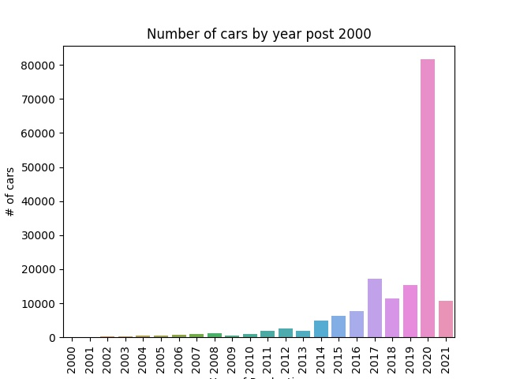

# Dimension_Reduction
# Background

Presented is an analysis of PUT LINKused Car salesEND LINK  provided by https://www.kaggle.com/ananaymital/us-used-cars-dataset.

This analysis covers <b>retieving data from a csv file, computation and data manipulation</b> as well as <b>answering business questions.</b>

This analysis is based purely in Python

It uses <i>Pandas and Numpy</i> for data manipulation and computation, <i>matplotlib and seaborn</i> for visualisations.

## Contents

# UNFINISHED, TO BE COMPLETED 

#### Dimension reduction techniques used on a dataset with 50+ variables ending in a PCA analysis on
 
1. Reducing Dimensions due to Missing values
1. Reducing Dimensions due to Highly Correlated variables
1. PCA Analysis
1. Save the data into csv files to the output folder
1. Save all visualisations to output folder

__List of Activities Still to be Completed:__

1. Create user guide for management and for analyst/developers
1. Volkswagon and Mercedes Benz csv files are empty, check the value name is correct
1. Label all visualisations properly, titles, xlabel, ylabel, legends
1. Combine PCA results to the end of the column of the data, save as csv, combine into one csv file when complete 
1. Output the story of the data with streamlit or dash as an interactive dashboard
1. Learn and apply markdown on this document and complete documentation and user guide
1. refactor and modularise code for performance

### Countplot of Jeeps pre-2000 sold in September 2020 from Cargurus

### Countplot of Jeeps post-2000 sold in September 2020 from Cargurus

### PCA analysis on vehicles made by Jeep

