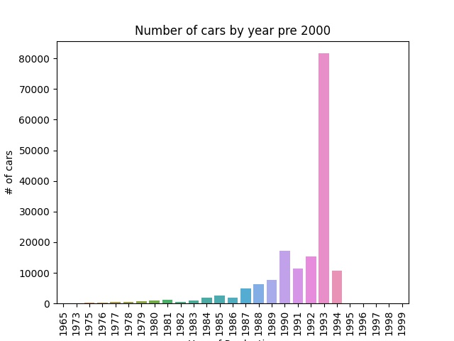

# Dimension_Reduction
#### Dimension reduction techniques used on a dataset with 50+ variables ending in a PCA analysis on

Dataset taken from: https://www.kaggle.com/ananaymital/us-used-cars-dataset
___
__List of activities completed:__

1. Reducing Dimensions due to Missing values
1. Reducing Dimensions due to Low variance
1. Reducing Dimensions due to Highly Correlated variables
1. PCA Analysis
1. Save the data into csv files to the output folder
1. Save all visualisations to output folder

__List of Activities Still to be Completed:__

1. Volkswagon and Mercedes Benz csv files are empty, check the value name is correct
1. Label all visualisations properly, titles, xlabel, ylabel, legends
1. Combine PCA results to the end of the column of the data, save as csv, combine into one csv file when complete 
1. Output the story of the data with streamlit or dash as an interactive dashboard
1. Learn and apply markdown on this document and complete documentation and user guide
1. refactor and modularise code for performance

